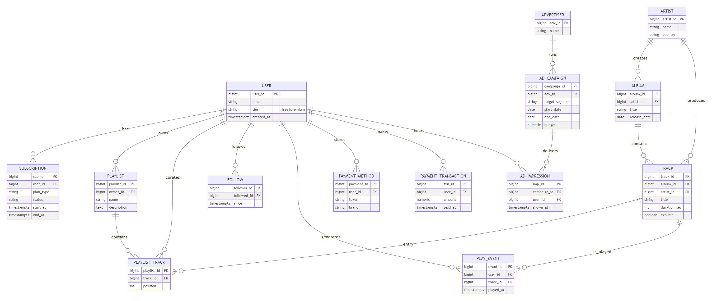

# 🎧 MelodyUD: Platform Design Inspired by Spotify’s Business Model  
### Exploring Database Structures for Scalable Music Platforms  
**Authors:**    
Brayan Yate & Holman Alvarado  
**Course:** Databases II  
**Year:** 2025

---

# 🧩 Business Model  
## Spotify's Freemium Model  

- **Free Users**: Ad-supported, limited skips  
- **Premium Users**: Ad-free, Hi-Fi audio, offline listening  
- **Revenue Streams**:
  - Subscriptions (main)
  - Advertisements (supporting growth)

---

# 📋 Functional Requirements  

- **Account Management**: Email/social sign-in, profile updates  
- **Content Ingestion**: Upload tracks, enrich with ML  
- **Playback & Delivery**: Adaptive bitrate, caching  
- **Discovery**: Search + Recommendations  
- **Advertising**: Campaigns, real-time targeting  
- **Analytics**: Real-time dashboards for creators  
- **Governance**: Tokenization, audit logs  

---

# ⚙️ Non-Functional Requirements  

- **Performance**:  
  - Playback start ≤ 300ms  
  - Search ≤ 150ms  
- **Scalability**:  
  - ≥ 1B users, 20M streams  
  - 10TB daily audio ingest  
- **Availability**:  
  - ≥ 99.95% uptime  
- **Maintainability**:  
  - OpenAPI docs, microservices < 3K LOC  

---

# 👤 User Roles

- **Listener**: Play, search, create playlists  
- **Creator**: Upload, view analytics, promote  
- **Advertiser**: Create and monitor campaigns  
- **Engineer**: Ensure uptime, scale, trace errors  
- **Compliance Officer**: Enforce GDPR, log retention  

---

# 📌 Some User Stories  

### Listener: Create Account  
- ✅ Sign up via email or social login  
- 🔐 Credentials hashed + MFA  

### Creator: Upload Audio  
- ✅ Submit file + metadata  
- 🗂️ Stored in catalog after validation  

---

# 🗃️ Initial Database Architecture  

**Goal**: Scalable, consistent, real-time data processing using only open-source tools.  
**Approach**: Microservice-oriented, data-layered architecture.  

<!-- <imagen src="image.png" width="200" height="100"> -->

---

# 🏗️ Data Architecture Breakdown  

| Layer | Purpose | Technologies |
|-------|---------|--------------|
| Hot OLTP | Critical ops (e.g. billing) | CockroachDB, Citus |
| Session Store | Playback, telemetry | Cassandra, Scylla |
| Object Storage | Audio, images | MinIO, Ceph |
| Search | Full-text autocomplete | OpenSearch |
| Graph Store | Social graph | Neo4j, JanusGraph |
| Event Stream | Activity logs | Kafka |
| Analytics | Real-time + Deep | Flink, Iceberg, Trino |

---

# 📈 ER Diagram Overview  
 

---

# ✅ Conclusion  

This project demonstrates:  
✔ Scalable and distributed data systems  
✔ Real-time features with Kafka + Flink  
✔ Secure, compliant design  
✔ Domain-specific data modeling

---

# 📚 References  

- Music Business Research (2024)  
- Investopedia – *How Spotify Makes Money*  
- LinkedIn: *Spotify Tech Stack*  
- Intuji – *Spotify Architecture Overview*
---

# 🙌 Thank You!  
Questions?

